# Hey, I’m Jules 👋

Software developer with foundations in low level languages, a love for clean and purposeful design, and a growing focus on backend infrastructure and cloud-native workflows.

Currently working on:

- 🎓 V2 of trancript 42, a tool to support students from the network 42 to showcase their skills and aid in job hunting
- 🔄 Backend infrastructure, cloud platforms & DevOps workflows (AWS, containers, CI/CD)
- 🔮 Fluency with AI, agents and LLMs tech 

🛠️ Past experience with drones 🚁 controlling system. 

<h3>Tech Stack</h3>

🎨 My past designer archive lives here → [JRB.at](https://jrb.at)

<h3>Connect with me</h3>

