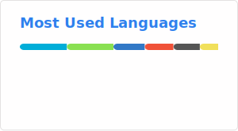

# Hi, I'm Jules 👋

💻 **Software Developer** | ☁️ **Backend & Cloud-Native** | 🎨 **Ex-Designer**

> Software developer with foundations in low-level languages, a love for clean and purposeful design, and a growing focus on backend infrastructure and cloud-native workflows.

<!-- ### 🔭 Currently Working On
- 🎓 **Transcript 42 (V2)** – A tool to support students from the 42 network to showcase their skills and aid in job hunting.
- 🔄 **Backend Infrastructure** – Building cloud platforms & DevOps workflows with AWS, containers, and CI/CD.
- 🔮 **AI & LLMs** – Working and experimenting with agents and modern AI tech.
- � **Robotics (Past)** – Experience designing and developing drone control systems. -->

### 🗂️ Projects

- 🌐 **Web Development**
  - **[Transcript42](https://github.com/julesrb/Transcript42)** – Fullstack TypeScript/Next.js web service generating academic transcripts from the 42 intranet, used by 500+ students for job hunting ⭐21
  - **[FIX-msg](https://github.com/julesrb/FIX-msg)** – Multi-threaded TCP trading simulator using FIX-style protocol with router, brokers, and markets (Java)
  <!-- - **[Spring_boot_calendar](https://github.com/julesrb/Spring_boot_calendar)** – Spring Boot backend for managing calendar events and time tracking
  - **[SQL_car_rent](https://github.com/julesrb/SQL_car_rent)** – Car rental management system with CRUD operations on a relational DB (Java/SQL) -->

- ⚙️ **DevOps**
  - **[Cloud-1](https://github.com/julesrb/Cloud-1)** – Automated AWS EC2 provisioning and persistent deployment via Ansible
  - **[Inception-of-Things](https://github.com/julesrb/Inception-of-Things)** – Hands-on exploration of Kubernetes and CI/CD tooling
  <!-- - **[inception](https://github.com/julesrb/inception)** – Docker-based multi-service infrastructure project (42 curriculum) -->

- 📱 **Mobile**
  - **[Swifty-Companion](https://github.com/julesrb/Swifty-Companion)** – Native iOS client for the 42 API with OAuth2 authentication and MVVM architecture
  <!-- - **[FloorPlan](https://github.com/julesrb/FloorPlan)** – iOS app in Swift
  - **[VelocityMirror](https://github.com/julesrb/VelocityMirror)** – iOS app in Swift -->
  - **[Swift_Piscine](https://github.com/julesrb/Swift_Piscine)** – iOS development fundamentals and training exercises

<!-- - 🔒 **Web Security** -->
  <!-- - **[transcendence](https://github.com/julesrb/transcendence)** – Includes secure auth flows and real-time communication hardening -->

- 🖥️ **Network & System**

  - **[ft_irc](https://github.com/julesrb/ft_irc)** – RFC-compliant IRC server and client implementation in C++
  - **[minishell](https://github.com/julesrb/minishell)** – Unix shell with pipes, redirections, builtins, and env variable handling (C)
  <!-- - **[FdF](https://github.com/julesrb/FdF)** – Wireframe 3D terrain renderer using MiniLibX (C)
  - **[avaj-launcher](https://github.com/julesrb/avaj-launcher)** – Java project implementing classical software design patterns -->

- 🖥️ **Other**
  - **[ddd-opti](https://github.com/julesrb/ddd-opti)** – React + C++ app for choreographing real drones and visualizing them in 3D space
  - **[cub3D](https://github.com/julesrb/cub3D)** – Raycasting 3D maze engine inspired by Wolfenstein 3D (C)

- 🖥️ **Open SourceContribution**
 - **[rncp](https://github.com/julesrb/rncp)** – Interactive RNCP Title planner website for 42 students (TypeScript)

 

  

### 📫 Connect & Links
- 🎨 My past designer archive lives here → **[JRB.at](https://jrb.at)**
- 💼 **[LinkedIn](https://linkedin.com/in/jules-bernard-52843099)**

